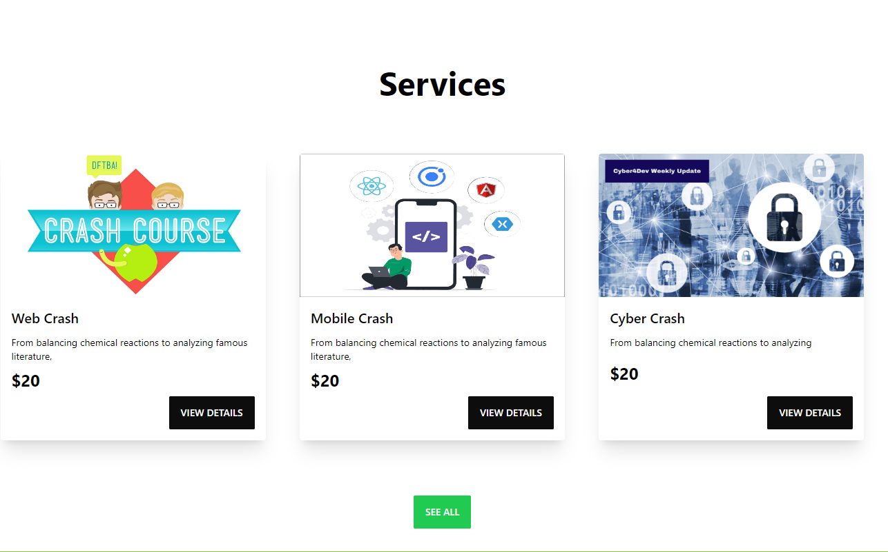
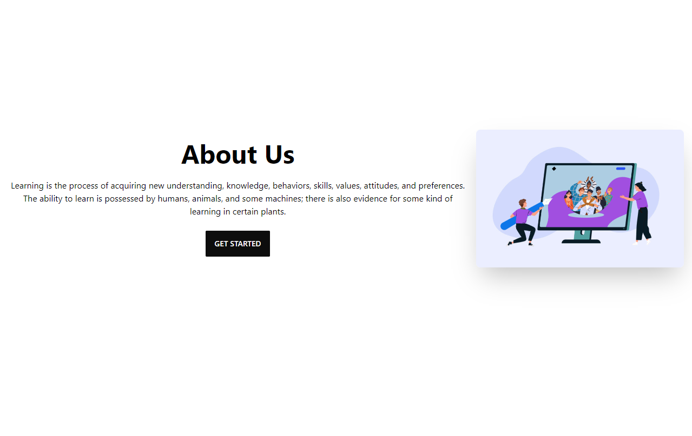
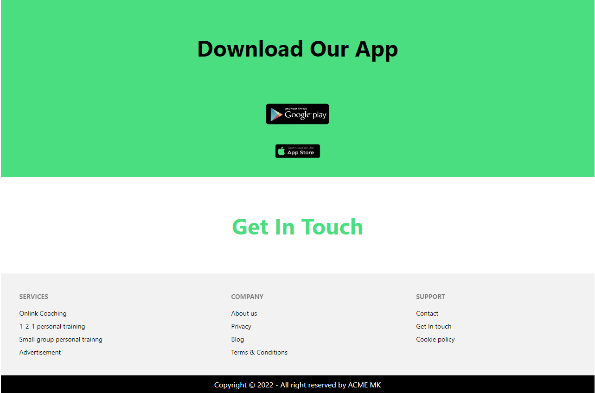

# Wellcome To MK
> Wellcome To MK.
> Live demo [MK](https://mk-client-8e8ba.web.app/). 

## Features are
- Include Private Route (without login can't access user)
- Data loaded from MongoDB via REST API
- Include Blog page
- Show Error when try to log in worng credentials 
- Can't multiple Create accounts by one email 
- Mobile responsive 
- User can can write review
- user can add new services 
- Used CRUD 

## library Used
   - buffer - version - ^6.0.3
   - daisyui - version - ^2.33.0
   - firebase - version - ^9.12.1,
   - react-hot-toast - version - ^2.4.0
   - react-router-dom - version - ^6.4.2
   - react-scripts - version - 5.0.1
   - react-to-pdf - version - ^0.0.14
   - react-helmet-async - ^1.3.0
   - react-photo-view - ^1.2.2

## Screenshots

